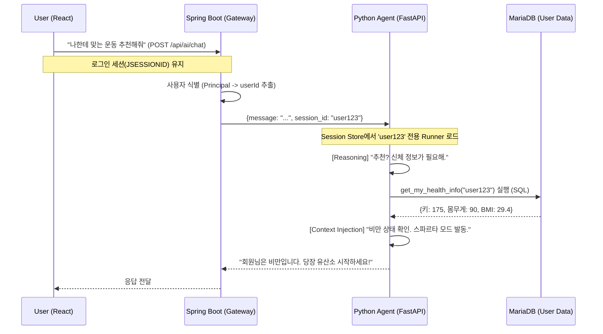

# 🧠 LongLife AI: Phase 2 - Session & Personalization

> **"기존 기능에서 Session&Memory기능을 구현하여 사용자별 코치를 만들고, DB에 접속하게끔 하여 맞춤 정보기반 대답 가능!"**

## 📌 Milestone Overview
본 문서는 **LongLife AI 프로젝트**의 **Phase 2 개발 과정**을 다룹니다.
단순한 질의응답 봇에서 벗어나, **사용자별 세션 격리(Session Isolation)**와 **RDBMS(MariaDB) 실시간 연동**을 통해 사용자의 신체 정보를 인지하고 개인화된 코칭을 제공하는 **Context-Aware Agent**로 진화시켰습니다.

---

## 🏗️ Architecture Evolution

기존의 Stateless한 구조에서 벗어나, **Spring Boot(Gateway)**와 **FastAPI(Agent)** 간의 세션 동기화를 구현했습니다.


---

## 🚀 Key Implementations
### 1. Session & Memory Isolation (세션 격리)
Challenge: Python Agent는 기본적으로 상태(State)가 없어, A 사용자의 대화가 B 사용자에게 섞이는 Cross-talk 문제가 발생할 수 있음.

Solution: session_store 딕셔너리를 구현하여 session_id를 Key로 하는 독립된 Runner 인스턴스를 관리.

로그인 유저: DB의 PK(userId)를 세션 키로 사용 (영속적 식별).

게스트: 브라우저 세션 ID(GUEST_xyz)를 사용하여 임시 격리.

### 2. SQL-Based Personalization (DB 연동 도구)
Feature: AI가 직접 SQL을 실행하여 사용자의 최신 건강 정보를 조회.

Tool Implementation: get_my_health_info 함수 구현.

pymysql을 사용하여 MariaDB users 테이블 조회.

키/몸무게 데이터를 바탕으로 BMI를 즉시 계산하여 AI에게 컨텍스트로 제공.

### 3. Context Injection (시스템 프롬프트 주입)
Engineering Decision: Google ADK의 ToolContext 객체 전달 방식이 모델 호환성 문제(400 INVALID_ARGUMENT)를 일으킴.

Optimization: 복잡한 객체 전달 대신, **명시적 인자 전달(user_id: str)**과 프롬프트 주입(Prompt Injection) 방식으로 선회.

User Prompt: (현재 사용자ID: user123) 운동 추천해줘

System: AI가 자연스럽게 user123을 인자로 사용하여 도구를 호출하도록 유도.

## 💻 Core Code Snippets
### Agent Configuration (Hybrid Tooling)

```Python
root_agent = Agent(
    name="fitness_coach_agent",
    model="gemini-2.5-flash-lite",
    description="Personal fitness coach.",
    instruction=(
        "당신은 스파르타 코치입니다. 다음 원칙을 지키세요:\n"
        "1. [개인화] 사용자가 추천을 원하면 [get_my_health_info] 도구로 몸 상태를 확인하세요.\n"
        "   - 비만이면 유산소, 저체중이면 근력 등 상태에 맞춰 강하게 조언하세요.\n"
        "2. [지식] 일반적인 운동 지식은 Google Search를 사용하세요.\n"
    ),
    tools=[google_search, get_my_health_info], 
)
```
## MaraDB 접근 도구
### 환경!
```Python
from typing import Dict
import pymysql #DB 연결용
```

### MariaDB 접근 도구 생성. -> 후에 각 도구를 든 Agent들을 만들어서 MultiAgent를 만들것.
``` Python
def get_my_health_info(user_id: str) -> str:
    """
    MariaDB에서 현재 사용자의 신체 정보(키, 몸무게, BMI)를 조회합니다.
    """
    
    print(f"🔧 [Tool 실행] DB 조회 요청: {user_id}")

    # DB 연결 설정 (환경변수 사용)
    db_pw = os.getenv("DB_PASSWORD")
    if not db_pw:
        return "시스템 에러: DB 비밀번호가 설정되지 않았습니다."
    
    # DB 연결 설정 유저
    db_us = os.getenv("DB_USER")
    if not db_us:
        return "시스템 에러: DB 유저가 설정되지 않았습니다."
    
    db_config = {
        "host": "localhost",
        "user": db_us,
        "password": db_pw,
        "db": "longlife",
        "charset": "utf8mb4"
    }
    
    try:
        conn = pymysql.connect(**db_config)
        with conn.cursor() as cursor:
            sql = "SELECT name, height, weight FROM users WHERE user_id = %s"
            cursor.execute(sql, (user_id,))
            row = cursor.fetchone()
            
            if not row:
                return f"회원 정보 없음 (ID: {user_id})"
            
            name, height, weight = row
            
            # BMI 계산
            bmi_msg = "정보 없음"
            if height and weight:
                h_m = height / 100
                bmi = weight / (h_m ** 2)
                status = "정상"
                if bmi >= 25: status = "비만"
                elif bmi < 18.5: status = "저체중"
                bmi_msg = f"{bmi:.1f} ({status})"
                
            return f"[회원 정보]\n이름: {name}\n키: {height}cm\n몸무게: {weight}kg\nBMI: {bmi_msg}"

    except Exception as e:
        return f"DB 에러: {str(e)}"
    finally:
        if 'conn' in locals(): conn.close()
```

## 🔮 Next Steps
* Phase 3: 현재 google_search tool과 get_my_health_info tool을 같이 쥐면 Agent가 충돌이 남.. 각자 하나씩 분리해서 MultiAgent로 해결할 예정
* 
[Root Agent (팀장)]

       |

       +---> [Search Agent (검색 담당)] --> google_search 도구만 가짐

       |

       +---> [DB Agent (회원 담당)] --> get_my_health_info 도구만 가짐
       
* Phase 4: 운동 종류 1,000여 개에 대한 전문 지식을 제공하기 위해 RAG (Vector DB) 시스템 통합 예정.
